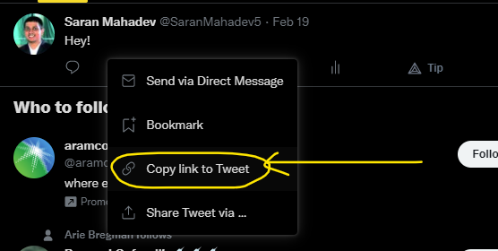
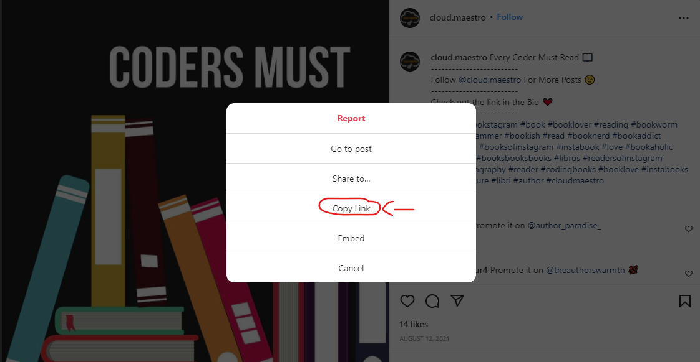
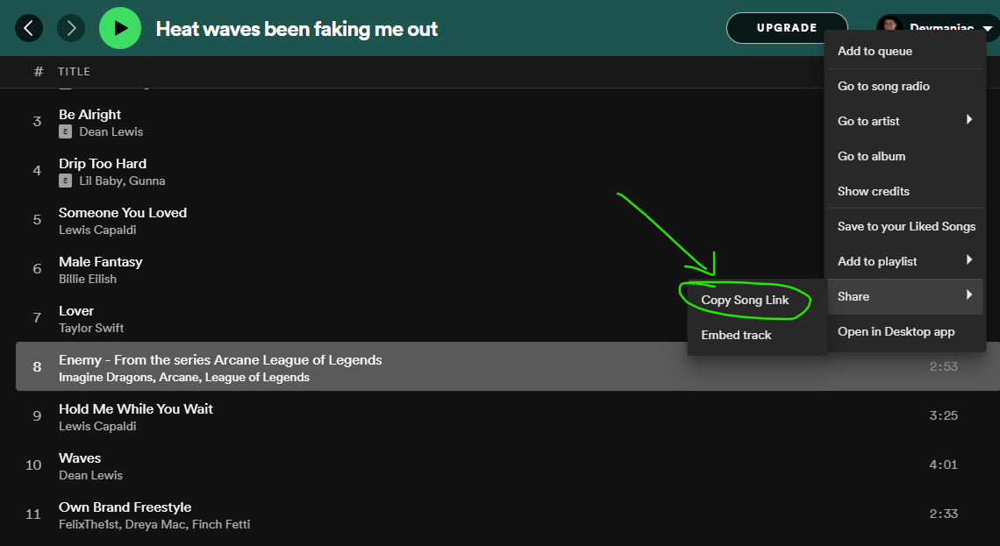

# Docsify Embed

Plugin for [Docsify](https://docsify.js.org/) to embed different types of content.

## Implementation

### YouTube

```%//[youtube](video-id)```

Get the ID of the video from the URL.

**Example:**

For the URL - https://www.youtube.com/watch?v=Zz0lHE-KKlA, the ID is **Zz0lHE-KKlA**.

```%//[youtube](Zz0lHE-KKlA)```

**Demo:**
%[youtube](Zz0lHE-KKlA)

---

### Codepen

```%//[codepen](username-penid-themeno)```

- Username - Username of the user on Codepen.
- PenID - PenID of the pen.
- ThemeNo - Theme number of the pen.

There are three themes available for the embed
- 0 - Default theme
- 1 - Dark theme
- 2 - Yellow theme

**Example**

For the Codepen: https://codepen.io/saranmahadev/pen/xxPzjWB, the username is **saranmahadev**, PenID is **xxPzjWB** and theme is your choice (I prefer 1).

```%//[codepen](saranmahadev-xxPzjWB-1)```

**Demo:**
%[codepen](saranmahadev-xxPzjWB-1)

---

### Twitter

```%//[twitter](tweet-url)```

**Example:**
Get the Link



The tweet-url is **https://twitter.com/SaranMahadev5/status/1494993462344642562**.

**Demo**
%[twitter](https://twitter.com/SaranMahadev5/status/1494993462344642562)

---

### GitHub

```%//[github](username/repository)```

- username - Username of the user on GitHub.
- repository - Repository name [Public Repository].

**Example:**

For the repository, https://github.com/saranmahadev/devops-digest, the username is **saranmahadev** and repository is **devops-digest**.

```%//[github](saranmahadev/devops-digest)```

**Demo:**

%[github](saranmahadev/devops-digest)

---

### Instagram

```%//[instagram](url)```

Grab the link of the post.



The post link is https://www.instagram.com/p/CSdT72dsAcy/.

```%//[instagram](https://www.instagram.com/p/CSdT72dsAcy/)```

**Demo:**

%[instagram](https://www.instagram.com/p/CSdT72dsAcy/)

---

### Spotify

```%//[spotify](songid-theme)```

songid - Song ID of the song.
theme - Theme of the song.



The copied link is https://open.spotify.com/track/4d1yaOX7QjaXNxa3uNmXv9 and the song ID is **4d1yaOX7QjaXNxa3uNmXv9** and the theme is **0** or **1**.

```%//[spotify](4d1yaOX7QjaXNxa3uNmXv9-1)```

**Demo:**

%[spotify](4d1yaOX7QjaXNxa3uNmXv9-0)

---